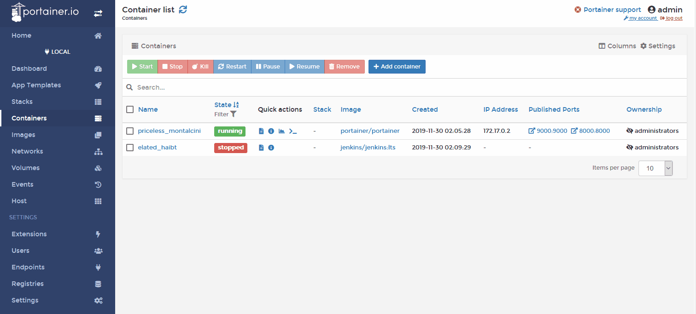
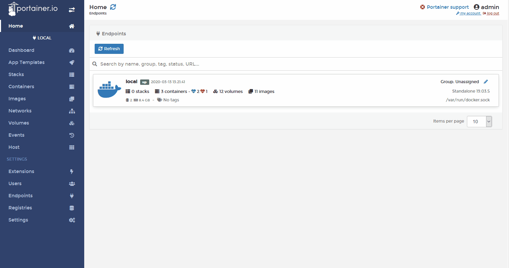

## About

This project provides [Portainer](https://www.portainer.io/) container templates for [Zeebe](https://zeebe.io/).

These templates are intended to quickly spin up a Zeebe node or cluster and take it for a test drive. They are not intended or recommended for production.

### Templates

- Zeebe Standalone Broker - Zeebe workflow engine with a single broker
- Zeebe Broker + Operate - Zeebe workflow engine with a broker and Operate frontend (and elasticsearch, Kibana as part of the backend)
- Zeebe Cluster S - Small Zeebe workflow engine cluster with three brokers and a gateway

> **Operate License** This Operate trial version is for testing and non-production use only. The General Terms and Conditions for the Operate Trial Version are available here: https://zeebe.io/legal/operate-evaluation-license/

### Usage

Assuming you have Docker and Portainer set up and running:

1. Open Portainer web console
1. Click on _Settings_
1. Copy this _URL_ into the input field under _App Templates_: `https://camunda-community-hub.github.io/zeebe-portainer-templates/templates.json`
   > **Note:** the templates are for Portainer 2.0 or higher
1. Click _Save Settings_
1. Click on _Home_ and select the Docker host on which you want to deploy Zeebe
1. Click on _App Templates_
1. Choose the template you want to use
1. Click on _Deploy the Container_ or _Deploy the stack_
1. Wait until the container(s) are running (this may take a while for your first deployment, as the images need to be downloaded)

### Troubleshooting

The most common reason why a deployment fails is that the port `26500` or the name of one of the containers is already in use.

When deploying a single container, you can modify both on the screen where you do the deployment:

### Customizing Container

Before deploying the template, you can enter a name for the container. You can also select _Show advanced options_. This allows you, among others, to specify the port mapping.
When deploying a stack of containers, this is not possible.

### Restoring Default Templates

1. Open Portainer web console
1. Click on _Settings_
1. Enter this in the _URL_ field `https://raw.githubusercontent.com/portainer/templates/master/templates-2.0.json`
1. Click _Save Settings_

### Next steps

Now that you have Zeebe running in Docker, you can direct a [client]([https://docs.zeebe.io/clients/index.html) at it and start experimenting.

All templates are configured to expose the command API port `26500` for clients to connect to.

All templates with a frontend also expose their web interface at port `8080`.

The default credentials for Operate are:

- user: `demo`
- password: `demo`

> **Operate License** This Operate trial version is for testing and non-production use only. The General Terms and Conditions for the Operate Trial Version are available here: https://zeebe.io/legal/operate-evaluation-license/

Later, if you want to gain more control over how Zeebe is deployed, you might want to look at:

- [zeebe-docker-compose](https://github.com/zeebe-io/zeebe-docker-compose): Which contains customizable docker compose files
- [zeeb-helm](https://helm.zeebe.io/): Which contains helm charts to deploy Zeebe to Kubernetes
